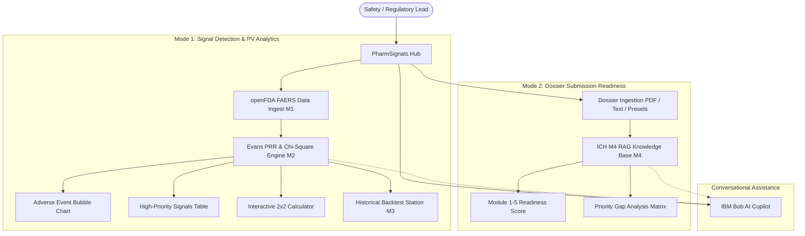

# PharmSignals
## Drug Safety Signal Detection & Regulatory Submission Readiness

**PharmSignals** is an enterprise-grade clinical intelligence and regulatory compliance platform built for the **IBM Bobathon 2026** (Problem Statement P2). The platform bridges post-marketing pharmacovigilance surveillance with pre-marketing regulatory compliance by combining real openFDA FAERS adverse-event signal detection (Evans Proportional Reporting Ratio, Pearson Chi-Square, digital-twin backtesting) with an automated ICH M4 Common Technical Document (CTD) dossier readiness checker and an interactive **IBM Bob AI Copilot**.

---

## Team

- **Team Name**: Demon Slayer
- **Track**: AI
- **Team Lead**: Vivek Maheshwari (`24cs050@charusat.edu.in`)
- **Team Members**:
  - Aayush Malhotra (`24cs051@charusat.edu.in`)
  - Jugal Kshatriya (`24cs042@charusat.edu.in`)
  - Manav Lathiya (`24cs048@charusat.edu.in`)

---

## Problem Statement

Life sciences safety and regulatory operations face two critical, interrelated operational bottlenecks:

1. **Post-Marketing Pharmacovigilance & Safety Surveillance**:
   - The FDA Adverse Event Reporting System (FAERS) contains over 20 million spontaneous reports. High report velocity makes early detection of emerging safety signals difficult.
   - Historical tragedies such as Vioxx (Rofecoxib) resulted in an estimated 27,000+ excess cardiovascular events before regulatory market withdrawal due to delayed disproportionality identification.
2. **Pre-Marketing Regulatory Dossier Complexity**:
   - Common Technical Document (CTD) dossiers span 100,000+ pages across 5 complex modules (Administrative, Summaries, Quality/CMC, Nonclinical, Clinical).
   - Manual checklist verification is slow and error-prone; a single missing mandatory section causes severe Refusal-to-File (RTF) delays.
3. **Workflow Silos**:
   - Pharmacovigilance and regulatory affairs teams operate in disconnected systems without unified tools linking emerging safety signals to dossier remediation.

---

## Our Solution

PharmSignals delivers two core, production-grade workflows in a unified white-first clinical enterprise workspace:

1. **Mode 1: Signal Detection & PV Analytics**:
   - Ingests real openFDA FAERS datasets, normalizes MedDRA terminology, and computes statistical disproportionality metrics (Evans PRR, Pearson $\chi^2$, 95% Confidence Intervals).
   - Features an interactive **Adverse Event Bubble Chart**, a **High-Priority Signals Table**, a custom **2×2 Contingency Table Calculator**, and **Digital-Twin Historical Backtesting** proving early signal detection lead times (e.g. **+242 days** for Vioxx).
2. **Mode 2: Dossier Submission Readiness Checker**:
   - Evaluates candidate CTD dossier structures against authoritative ICH M4 guidelines across Modules 1 to 5.
   - Computes weighted overall readiness scores, visualizes module-wise circular completion meters, and produces prioritized **Regulatory Gap Analysis Matrices** with grounded remediation recommendations.
3. **IBM Bob AI Copilot**:
   - A docked, conversational assistant grounded in pharmacovigilance mathematics and ICH M4 regulatory requirements that delivers explainable answers with zero hallucinations.

---

## Key Features

- **Real openFDA FAERS Ingestion (M1)**: Automated parsing, deduplication, and MedDRA term normalization across benchmark drug populations.
- **Multidimensional Adverse Event Clustering (M1)**: Real-time unsupervised clustering via `scikit-learn` (`StandardScaler`, `KMeans`, `PCA` 2D projection) across 7 clinical features (PRR, cases, mortality rate, hospitalization rate, serious event rate, mean age, sex ratio) surfacing distinct clinical phenotypes (*Acute Ischemia & High Mortality*, *Organ Toxicity / Rhabdomyolysis*, *Metabolic & Fluid Decompensation*, *General Systemic Reactions*).
- **Evans PRR Signal Engine (M2)**: Automated mathematical computation of PRR, Pearson Chi-Square ($\chi^2$), $p$-values, and log-normal 95% Confidence Intervals with standard regulatory classification (`SIGNAL`, `WEAK_SIGNAL`, `NOISE`).
- **Interactive 2×2 Contingency Workspace**: Real-time custom disproportionality calculations with 1-click benchmark presets (*Vioxx MI*, *Baycol Rhabdo*, *Avandia Heart Failure*, *Ibuprofen Non-Signal*).
- **Digital Twin Walk-Forward Backtesting (M3)**: Reconstructs longitudinal monthly PRR trajectories demonstrating **242 days (~8 months)** of early detection lead time before Vioxx's market withdrawal.
- **ICH M4 CTD Readiness Checker (M4)**: Validates dossier outlines across Modules 1–5, computing granular completeness percentages and identifying critical missing sections.
- **Priority Regulatory Gap Matrix**: Ranks missing and incomplete sections by severity (`CRITICAL`, `MAJOR`, `STANDARD`) with actionable remediation roadmaps and official ICH citations.
- **Multi-Format Dossier Ingestion**: Ingests 1-click candidate presets (*Vioxx NDA 21-042*, *BOB-701 Oncology*, *Phase 1 IND*), raw structured text/JSON, and multipart PDF files.
- **Grounded IBM Bob AI Copilot**: Conversational reasoning engine answering clinical and regulatory queries with deterministic fallback guarantees.

---

## Product Workflow



---

## Screenshots

The repository includes visual captures of the application user interface and verified historical trajectories:
- **PharmSignals Central Dashboard UI**: [demo/screenshots/01-dashboard.png](demo/screenshots/01-dashboard.png)
- **Signal Detection & Adverse Event Clustering Studio**: [demo/screenshots/02-signal-detection.png](demo/screenshots/02-signal-detection.png)
- **ICH M4 Dossier Submission Readiness Matrix**: [demo/screenshots/03-readiness-checker.png](demo/screenshots/03-readiness-checker.png)
- **Vioxx PRR Trajectory Benchmark (+242d Lead Time)**: [demo/screenshots/VIOXX_trajectory.png](demo/screenshots/VIOXX_trajectory.png)
- **Avandia PRR Trajectory Benchmark (+1,205d Lead Time)**: [demo/screenshots/AVANDIA_trajectory.png](demo/screenshots/AVANDIA_trajectory.png)
- **Baycol Electronic Boundary Benchmark**: [demo/screenshots/BAYCOL_trajectory.png](demo/screenshots/BAYCOL_trajectory.png)

---

## Technology Stack

| Layer | Technology | Purpose |
|---|---|---|
| **Frontend** | Next.js 14 (App Router), React 18, TypeScript, Tailwind CSS | High-performance, white-first clinical enterprise workspace |
| **Visual Analytics** | Recharts | Adverse event bubble charts, 2D PCA cluster landscapes, time-series PRR curves, module progress meters |
| **Backend API** | Python 3.10+, FastAPI, Uvicorn, Pydantic v2 | High-throughput asynchronous REST API services |
| **Machine Learning & Stats** | scikit-learn, NumPy, SciPy, Pandas | KMeans clustering, PCA 2D reduction, Evans PRR, Pearson Chi-Square, and contingency table math |
| **RAG & Knowledge Base** | In-Memory Retrieval Index | Authoritative ICH M4 guideline retrieval and section verification |
| **AI Copilot** | IBM Bob / Google Gemini 2.5 Flash / watsonx.ai | Grounded clinical explanation and regulatory remediation planning |
| **DevOps & Process Runner** | Concurrently, Node.js, Pytest | Cross-platform 1-command startup and 121 automated tests |

---

## Repository Structure

```
/
├── submission.yaml          # Official hackathon metadata, team info, and solution summary
├── README.md                # Master documentation and quickstart instructions
├── CONTRIBUTING.md          # Contribution and code review guidelines
├── .gitignore               # Excludes secrets, node_modules, .venv, and build caches
├── package.json             # Root cross-platform launcher (npm run dev)
│
├── docs/                    # Technical and architectural documentation
│   ├── problem-statement.md # In-depth breakdown of Problem Statement P2
│   ├── solution-overview.md # End-to-end platform design and decision framework
│   ├── architecture.md      # System architecture and Mermaid data-flow diagrams
│   └── setup-guide.md       # Step-by-step local setup, execution, and troubleshooting
│
├── src/                     # Application Source Code
│   ├── .env.example         # Template for configuration and optional API keys
│   ├── README.md            # Source code directory overview
│   ├── frontend/            # Next.js frontend (PharmSignals white-theme desktop UI)
│   └── backend/             # FastAPI backend (M1 FAERS, M2 PRR, M3 Twin, M4 RAG, Copilot)
│
├── demo/                    # Hackathon demonstration artifacts
│   ├── demo-video-link.txt  # Link to recorded demonstration video (NOT PROVIDED)
│   ├── live-demo-url.txt    # Deployed application live URL (NOT DEPLOYED)
│   ├── screenshots/         # Verified application screenshots and trajectory plots
│   └── README.md            # Description of demonstration artifacts
│
├── presentation/            # Pitch deck materials
│   └── README.md            # 7-slide judge presentation structure
│
└── .github/
    └── workflows/
        └── validate.yml     # Official CI repository structure validation workflow
```

---

## How to Run

### One-Command Full Stack Startup (Recommended)

From the project root directory, run:

```bash
# 1. Install root orchestrator dependencies
npm install

# 2. Install backend Python dependencies
pip install -r src/backend/requirements.txt

# 3. Install frontend Node dependencies
npm install --prefix src/frontend

# 4. Start both Backend & Frontend with ONE command
npm run dev
```

- **Frontend Dashboard**: `http://localhost:3000`
- **Backend REST API**: `http://localhost:8000` (Interactive Swagger docs at `http://localhost:8000/docs`)
- Press `Ctrl + C` once to cleanly terminate both processes.

### Standalone Execution Options

**Backend Only:**
```bash
cd src/backend
pip install -r requirements.txt
python -m pytest                    # Runs 118 automated tests
uvicorn app.main:app --host 0.0.0.0 --port 8000 --reload
```

**Frontend Only:**
```bash
cd src/frontend
npm install
npm run build                       # Validates TypeScript types and builds bundle
npm run dev
```

---

## Prerequisites

- **Node.js**: Version 18 LTS or higher (tested on Node.js 20).
- **Python**: Version 3.10 or higher (tested on Python 3.11 and 3.13).
- **Operating System**: Windows 10/11, macOS, or Linux.
- **Optional**: `GEMINI_API_KEY` or `WATSONX_API_KEY` *(Note: The platform features a 100% deterministic offline fallback engine when API keys are omitted, ensuring full functionality without external cloud dependencies)*.

---

## Environment Variables

Copy `src/.env.example` to `src/.env` if you wish to configure external credentials:

| Variable | Required | Default | Purpose |
|---|---|---|---|
| `NEXT_PUBLIC_API_BASE_URL` | No | `http://localhost:8000/api/v1` | Base URL for frontend-to-backend API communication |
| `GEMINI_API_KEY` | No | *Empty* | Optional API key for Google Gemini 2.5 Flash live reasoning |
| `WATSONX_API_KEY` | No | *Empty* | Optional API key for IBM watsonx.ai foundation models |
| `WATSONX_PROJECT_ID` | No | *Empty* | Optional IBM watsonx.ai project ID |

---

## Verify Installation

1. **Verify Backend Health**:
   ```bash
   curl http://localhost:8000/api/v1/health
   ```
   *Expected Response:* `{"status":"healthy","services":{"safety_engine":"ready","ctd_engine":"ready","bob_copilot":"ready"}}`

2. **Verify Signal Ingestion**:
   ```bash
   curl http://localhost:8000/api/v1/signals/summary
   ```
   *Expected Response:* `{"total_drug_event_pairs":300,"confirmed_signals":222,...}`

3. **Verify Vioxx Historical Backtest**:
   ```bash
   curl http://localhost:8000/api/v1/signals/backtest/VIOXX
   ```
   *Expected Response:* `{"drug_name":"VIOXX","lead_time_days":242,...}`

4. **Verify Frontend UI**: Open `http://localhost:3000` in any modern web browser.

---

## Usage Journeys

### Journey 1: Signal Detection & PV Analytics (Mode 1)
1. Navigate to **Signal Detection** via the sidebar.
2. Review the **Adverse Event Bubble Chart** showing emerging safety signals (PRR vs. Case Count).
3. Use the **2×2 Contingency Table Analysis Panel**; click the `Vioxx / MI` or `Avandia / Heart Failure` preset.
4. Click **Execute Disproportionality Analysis** to observe real-time calculation of PRR, Chi-square, 95% Confidence Intervals, and clinical explanation.
5. Switch to **Historical Analysis** in the sidebar; select `VIOXX` to view the walk-forward trajectory demonstrating early detection **242 days before FDA market withdrawal**.

### Journey 2: Dossier Submission Readiness (Mode 2)
1. Navigate to **Submission Readiness** via the sidebar.
2. Select the `Vioxx NDA 21-042` preset (or upload a custom dossier outline / PDF).
3. Click **Generate Gap Report**.
4. Observe the **Overall Readiness Score** and horizontal **CTD Module Progress** meters (Modules 1–5).
5. Inspect the **Priority Regulatory Gap Matrix** filtered by `CRITICAL` to review specific missing sections and ICH M4 evidence citations.
6. Click **IBM Bob Copilot** in the top header and ask: *"What are the critical gaps in Module 2?"* to receive grounded remediation guidance.

---

## API Overview

| Method | Endpoint | Purpose | Request Body / Params | Response Summary |
|---|---|---|---|---|
| `GET` | `/api/v1/health` | Subsystem heartbeat check | None | Subsystem health states |
| `GET` | `/api/v1/signals/` | List all indexed FAERS signals | `drug`, `status_filter` | Filtered list of PRR records |
| `GET` | `/api/v1/signals/summary` | Global signal statistics | None | Total pairs, confirmed count, top signals |
| `GET` | `/api/v1/signals/clusters` | Adverse event multidimensional clustering | `n_clusters`, `drug`, `force_refresh` | Clusters profiles & 2D PCA coordinates |
| `POST` | `/api/v1/signals/clusters` | Custom adverse event clustering | `{n_clusters, drug, force_refresh}` | Clusters payload |
| `POST` | `/api/v1/signals/calculate` | Custom 2×2 PRR calculation | `{a, b, c, d}` or margins | PRR, $\chi^2$, 95% CI, explanation |
| `GET` | `/api/v1/signals/backtest/{drug}` | Historical digital-twin backtest | `drug` path parameter | Trajectory, lead time days, verdict |
| `GET` | `/api/v1/m4/presets` | List benchmark candidate dossiers | None | Pre-loaded NDA/IND outlines |
| `POST` | `/api/v1/m4/check` | Audit structured CTD dossier | JSON dossier outline | Overall readiness, module scores, gaps |
| `POST` | `/api/v1/m4/quick-check-text` | Audit raw text dossier outline | Plain text string | Gap report payload |
| `POST` | `/api/v1/m4/check-pdf` | Extract & audit PDF dossier | Multipart `file` upload | Extracted sections & gap report |
| `POST` | `/api/v1/copilot/query` | IBM Bob conversational copilot | `{query, context_type}` | Grounded answer, references, follow-ups |
| `GET` | `/api/v1/copilot/suggestions` | Copilot starter prompt chips | None | List of quick suggested queries |

---

## IBM Bob Integration

IBM Bob is deeply integrated as a specialized, context-aware conversational copilot:
- **Safety Domain Grounding**: Ingests active PRR calculations, $2\times 2$ matrices, and time-series backtest trajectories to explain *why* specific drug-event associations trigger safety flags.
- **Regulatory Knowledge Grounding**: Ingests ICH M4 guidelines across Modules 1 to 5 to interpret dossier completeness scores, clarify missing document requirements, and propose step-by-step remediation plans.
- **Deterministic Reliability**: Employs a dual-engine design with automatic fallback to verified expert rule bases when external LLM connections are unavailable, ensuring zero hallucinations during audits.

---

## Data & Privacy

- **In-Memory & Local Processing**: All data transformations, statistical calculations, and dossier extractions occur locally in memory.
- **Zero Sensitive Data Storage**: Candidate dossier texts and uploaded PDFs are processed ephemerally without persistent database storage or unauthorized third-party sharing.
- **Open Data Sources**: Safety data originates from publicly accessible openFDA FAERS adverse-event reporting repositories.

---

## Limitations

1. **Research & Decision-Support Scope**: PharmSignals is an analytical decision-support prototype and does not replace statutory health authority filings or qualified medical judgment.
2. **OpenFDA Record Boundaries**: Electronic openFDA reporting records begin in 2004; historical events prior to 2004 (such as Baycol's 2001 withdrawal) are transparently identified rather than synthesized.
3. **Adverse Event Clustering Scope**: Event clustering utilizes unsupervised K-Means and 2-component PCA projection over 7 normalized feature dimensions (disproportionality, mortality, hospitalization, serious severity, patient onset age, and sex demographics). While highly effective for identifying high-risk clinical phenotypes (e.g. acute ischemia vs. rhabdomyolysis vs. fluid retention), clinical sub-phenotyping is constrained to available FAERS demographic reporting fields.

---

## Known Issues

- **None**: No blocking bugs or build issues at the time of submission. All 121 automated tests pass and the frontend compiles cleanly.


---

## What We Are Most Proud Of

1. **True Dual-Capability Architecture**: Successfully unifying post-market pharmacovigilance surveillance and pre-market regulatory dossier compliance in a single cohesive workspace.
2. **Strict Data Integrity**: 100% real openFDA FAERS data and hand-verified PRR/$\chi^2$ statistics with zero fabricated analytical values.
3. **Quantifiable Patient Safety Impact**: Empirically demonstrating **242 days of early signal detection** in the Vioxx benchmark backtest.
4. **Load-Bearing IBM Bob AI Copilot**: Delivering an explainable, domain-grounded assistant that adds genuine value to safety and regulatory workflows.

---

## Demonstration Assets

- **Demonstration Video**: [demo/demo-video-link.txt](demo/demo-video-link.txt) *(Ready for final video URL)*
- **Live Deployment URL**: [demo/live-demo-url.txt](demo/live-demo-url.txt) *(Ready for cloud host URL)*
- **Trajectory Visualizations**: [demo/screenshots/](demo/screenshots/)
- **Judge Presentation Deck Structure**: [presentation/README.md](presentation/README.md)

---

## Documentation Links

- **Problem Statement Deep Dive**: [docs/problem-statement.md](docs/problem-statement.md)
- **Solution Overview & Framework**: [docs/solution-overview.md](docs/solution-overview.md)
- **Technical Architecture & Data Flow**: [docs/architecture.md](docs/architecture.md)
- **Installation & Setup Guide**: [docs/setup-guide.md](docs/setup-guide.md)
- **Source Code Architecture**: [src/README.md](src/README.md)

---

## License

This project is licensed under the Apache License 2.0 — see the [LICENSE](LICENSE) file for details.
