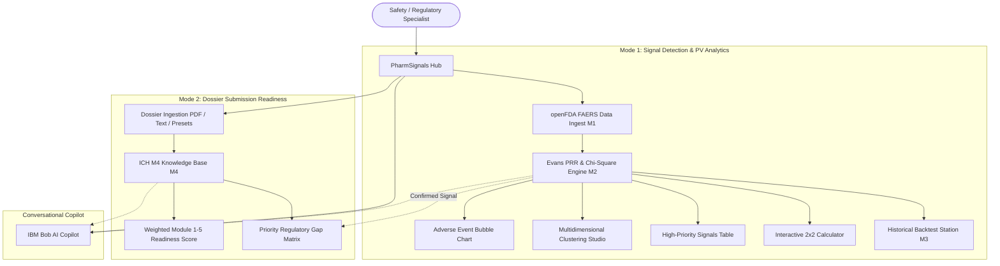

# PharmSignals
## Drug Safety Signal Detector & Regulatory Submission Readiness Checker

**PharmSignals** is an enterprise-grade clinical intelligence and regulatory compliance platform built for the **IBM Bobathon 2026** under **Problem Statement P2**. The platform bridges post-marketing pharmacovigilance surveillance with pre-marketing regulatory submission readiness by combining real openFDA FAERS adverse-event signal detection (Evans Proportional Reporting Ratio, Pearson $\chi^2$, multidimensional clustering, and walk-forward longitudinal backtesting) with an automated ICH M4 Common Technical Document (CTD) dossier readiness checker and an interactive **IBM Bob AI Copilot** powered by Google Gemini 2.5 Flash.

---

## Team

- **Team Name**: Demon Slayer
- **Track**: AI
- **Team Lead**: Vivek Maheshwari (`24cs050@charusat.edu.in`)
- **Team Members**:
  - Aayush Malhotra (`24cs051@charusat.edu.in`)
  - Jugal Kshatriya (`24cs042@charusat.edu.in`)
  - Manav Lathiya (`24cs048@charusat.edu.in`)

---

## Problem Statement (P2)

Life sciences safety and regulatory operations face two critical, interrelated operational bottlenecks that share the exact same root cause: **too much voluminous, complex data for manual review workflows**:

1. **Post-Marketing Pharmacovigilance & Safety Surveillance (Mode 1)**:
   - The FDA Adverse Event Reporting System (FAERS) database contains over **20 million+ spontaneous adverse event reports**. High report velocity and confounding factors make early detection of subtle, emerging safety signals difficult.
   - Historical tragedies such as **Vioxx (rofecoxib)** caused an estimated **27,000+ excess heart attacks / cardiovascular events** before regulatory market withdrawal because safety signals went unacted upon.
2. **Pre-Marketing Regulatory Dossier Complexity (Mode 2)**:
   - Common Technical Document (CTD) dossiers span **100,000+ pages across 5 complex modules** (Module 1: Administrative Information; Module 2: Summaries; Module 3: Quality/CMC; Module 4: Nonclinical Study Reports; Module 5: Clinical Study Reports).
   - Manual checklist verification is slow and error-prone; a single missing mandatory section causes immediate **Refusal-to-File (RTF)** rejections, delaying drug approvals by **6–12 months** and costing sponsors **$50–$100 million** in direct expenses and lost market exclusivity.
3. **Workflow Silos**:
   - Pharmacovigilance and regulatory affairs teams operate in disconnected systems without unified tools linking emerging safety signals to regulatory dossier remediation.

---

## Our Solution

PharmSignals delivers two core workflows in a unified clinical enterprise workspace:

1. **Mode 1: Signal Detection & PV Analytics** — fully implemented.
   - Ingests real openFDA FAERS datasets, normalizes MedDRA terminology, and computes statistical disproportionality metrics (Evans PRR, Pearson $\chi^2$, 95% Confidence Intervals).
   - Features an interactive **Adverse Event Bubble Chart**, a **High-Priority Signals Table**, an interactive **2×2 Contingency Table Calculator**, a live openFDA lookup for arbitrary drugs, an **Adverse Event Multidimensional Clustering Studio** (scikit-learn KMeans + PCA), and **Digital-Twin Historical Backtesting** proving early signal detection lead times (e.g., **+242 days** on Vioxx).
2. **Mode 2: Submission Readiness Checker** — fully implemented.
   - Evaluates candidate CTD dossier structures (JSON, plain text, or uploaded PDF) against authoritative ICH M4 guidelines across Modules 1 to 5.
   - Computes a **criticality-weighted** overall readiness score (a missing filing-blocker section drags the score down more than a missing supporting document), visualizes module-wise completion, and produces a prioritized **Regulatory Gap Analysis Matrix** with grounded remediation recommendations and a PDF export.
   - Cross-links to Mode 1: a drug with a confirmed FAERS/PRR safety signal automatically flags its CTD safety sections (Module 2.7, Module 5.3.6) for mandatory review.
3. **IBM Bob AI Copilot** — fully implemented.
   - A docked conversational assistant, grounded in pharmacovigilance mathematics and ICH M4 regulatory requirements, powered by **Google Gemini 2.5 Flash** with a deterministic rule-based fallback that guarantees a correct, zero-hallucination answer even with no API key configured.

---

## Key Features

- **Real openFDA FAERS Ingestion (M1)**: Automated parsing, deduplication, and MedDRA term normalization across benchmark post-marketing surveillance datasets (VIOXX, BAYCOL, AVANDIA).
- **Evans PRR Signal Engine (M2)**: Automated mathematical computation of PRR, Pearson Chi-Square ($\chi^2$), $p$-values, and log-normal 95% Confidence Intervals with standard regulatory classification (`SIGNAL`, `WEAK_SIGNAL`, `NOISE`).
- **Live openFDA Lookup**: Queries the real openFDA `drug/event.json` API live for any drug name, not limited to the three pre-loaded benchmarks.
- **Interactive 2×2 Contingency Workspace**: Real-time custom disproportionality calculations with 1-click benchmark presets (*Vioxx MI*, *Baycol Rhabdo*, *Avandia Heart Failure*, *Ibuprofen Non-Signal*).
- **Multidimensional Adverse Event Clustering**: Real-time unsupervised clustering via `scikit-learn` (`StandardScaler`, `KMeans`, `PCA` 2D projection) across 7 clinical features (PRR, cases, mortality rate, hospitalization rate, serious event rate, mean age, sex ratio) surfacing distinct clinical phenotypes.
- **Digital Twin Walk-Forward Backtesting (M3)**: Reconstructs longitudinal monthly PRR trajectories demonstrating **242 days (~8 months)** of early detection lead time before Vioxx's FDA market withdrawal.
- **ICH M4 CTD Readiness Checker (M4)**: Validates dossier outlines across Modules 1–5 using a hybrid exact-ID + semantic (sentence-embedding) matcher, with a global optimal assignment between dossier sections and ICH requirements rather than a greedy match.
- **Criticality-Weighted Readiness Score**: Overall and per-module completeness weight `CRITICAL` sections above `MAJOR`/`STANDARD`/`OPTIONAL` ones, so the headline score reflects actual filing risk.
- **Priority Regulatory Gap Matrix**: Ranks missing and incomplete sections by severity (`CRITICAL`, `MAJOR`, `STANDARD`) with actionable remediation roadmaps and official ICH citations.
- **Multi-Format Dossier Ingestion**: Ingests candidate presets (*Vioxx NDA 21-042*, *BOB-701 Oncology IND*, *Phase 1 IND EXP-101*), raw structured text/JSON, and multipart PDF files.
- **Mode 1 ↔ Mode 2 Safety Cross-Link**: A confirmed FAERS signal for a drug automatically flags its CTD safety sections for mandatory review.
- **IBM Bob Copilot**: Conversational reasoning engine (Google Gemini 2.5 Flash primary, deterministic rule-based fallback) answering clinical and regulatory queries with live domain grounding.

---

## Product Workflow



---

## Demonstration & Media

- **Demo Video Walkthrough**: [https://youtu.be/7POfIsw83OA](https://youtu.be/7POfIsw83OA)
- **Live Deployment**: `NOT DEPLOYED` (the application is evaluated locally via the reproducible setup below and the recorded demo video). Reference cloud deployment steps are documented in [`DEPLOY.md`](DEPLOY.md).
- **Slide Deck Presentation**: [`presentation/slides.pdf`](presentation/slides.pdf) (14-slide executive presentation covering Problem, Solution, Demo/Architecture, IBM Technology Integration, and Impact).
- **Verified Application Screenshots**:
  - [demo/screenshots/01-dashboard.png](demo/screenshots/01-dashboard.png) — Central Pharmacovigilance Dashboard with KPIs & Bubble Chart
  - [demo/screenshots/02-signal-detection.png](demo/screenshots/02-signal-detection.png) — Signal Detection Workspace, 2×2 Calculator & Clustering Studio
  - [demo/screenshots/03-historical-analysis.png](demo/screenshots/03-historical-analysis.png) — Historical Backtest showing +242 days early detection lead time
  - [demo/screenshots/04-submission-readiness.png](demo/screenshots/04-submission-readiness.png) — ICH M4 CTD Submission Readiness Audit across Modules 1–5
  - [demo/screenshots/05-reports-and-export.png](demo/screenshots/05-reports-and-export.png) — Reports & Regulatory Data Export Workspace

---

## Technology Stack

| Layer | Technology | Purpose |
|---|---|---|
| **Frontend** | Next.js 14 (App Router), React 18, TypeScript, Tailwind CSS | High-performance, white-first clinical enterprise workspace |
| **Visual Analytics** | Recharts | Adverse event bubble charts, 2D PCA cluster landscapes, time-series PRR curves, module progress meters |
| **Backend API** | Python 3.10+, FastAPI, Uvicorn, Pydantic v2 | High-throughput asynchronous REST API services |
| **Machine Learning & Stats** | scikit-learn, NumPy, SciPy, Pandas | KMeans clustering, PCA 2D reduction, Evans PRR, Pearson $\chi^2$, contingency table math, and a global optimal (Hungarian-algorithm) match between dossier sections and ICH requirements |
| **RAG & Knowledge Base** | `sentence-transformers` embeddings + in-memory retrieval index | Authoritative ICH M4 guideline retrieval, exact + semantic section verification |
| **AI Copilot** | IBM Bob persona, powered by **Google Gemini 2.5 Flash** | Grounded clinical explanation and regulatory remediation planning, with a deterministic rule-based fallback when no API key is configured |
| **DevOps & Testing** | Concurrently, Node.js, Pytest | Cross-platform 1-command startup and 127 automated backend tests |

---

## IBM Bob Integration

IBM Bob was utilized in two distinct, impactful capacities:

### 1. IBM Bob as Development & Engineering SDLC Partner
- **Requirements Decomposition**: IBM Bob analyzed the official Industry Problem Statements P2 requirements, mapping clinical and regulatory specifications to software components.
- **Architecture & Implementation**: Guided the design of the dual-engine architecture, separating statistical signal calculation (NumPy/SciPy/Pandas) from the ICH M4 compliance verification pipeline.
- **Test Suite Generation**: Assisted in authoring comprehensive automated tests across all sub-modules, resulting in **127 passing unit tests** covering edge cases, contingency math, schema validation, and API contracts.
- **Documentation & Compliance**: Streamlined alignment with the official IBM Bobathon Submission Template Guide.

### 2. Runtime IBM Bob Copilot in the Application
- **Domain-Grounded Assistance**: An interactive right-side drawer Copilot (`/api/v1/copilot/query`) directly accessible from any workspace, powered by **Google Gemini 2.5 Flash**.
- **Context Injection**: Dynamically injects live calculations (active PRR values, $\chi^2$ statistics, contingency table margins) and ICH M4 regulatory guidelines into copilot prompts.
- **Deterministic Offline Guarantee**: When `GEMINI_API_KEY` is not configured (or the live call fails), the Copilot automatically fails over to a deterministic, rule-based pharmacovigilance expert engine, ensuring zero hallucinations and full functionality during regulatory audits or offline judging.

---

## Synthetic Benchmark & Test Data Disclosure

To ensure complete transparency and regulatory integrity:
- **FAERS Post-Marketing Surveillance**: Mode 1 runs on genuine openFDA FAERS quarterly adverse event records (2004–2023) cleaned and normalized for benchmark safety signals (VIOXX / rofecoxib, BAYCOL / cerivastatin, AVANDIA / rosiglitazone).
- **Synthetic M4 Benchmark Dossiers**: The candidate dossier outlines (Vioxx NDA 21-042, BOB-701 Oncology IND, and Phase 1 IND EXP-101) are **synthetic benchmark test dossiers** constructed from published ICH M4 CTD specifications, provided solely for testing, validation, and demonstration purposes. They do not represent proprietary sponsor submissions, and the readiness percentage shown for each will vary by preset (each is intentionally only partially complete, to exercise the gap-detection engine).

---

## Repository Structure

```
/
├── submission.yaml          # Official hackathon metadata, team info, and solution summary
├── README.md                # Master documentation and quickstart instructions
├── CONTRIBUTING.md          # Contribution and development guidelines
├── LICENSE                  # Apache 2.0 license
├── DEPLOY.md                # Cloud deployment reference guide
├── render.yaml               # Render blueprint for the backend
├── package.json             # Root cross-platform launcher (npm run dev)
├── package-lock.json        # Root dependency lockfile
│
├── docs/                    # Official written documentation
│   ├── problem-statement.md # Deep dive on Problem Statement P2
│   ├── solution-overview.md # Conceptual architecture and algorithmic details
│   ├── architecture.md      # Technical architecture, Mermaid diagrams, and data flow
│   └── setup-guide.md       # Step-by-step local setup, execution, and troubleshooting
│
├── src/                     # Application Source Code
│   ├── .env.example         # Template for configuration and environment variables
│   ├── README.md            # Source code directory structure overview
│   ├── frontend/            # Next.js 14 frontend (PharmSignals clinical dashboard)
│   └── backend/             # FastAPI backend (M1 FAERS, M2 PRR, M3 Twin, M4 RAG, Copilot)
│
├── demo/                    # Hackathon demonstration artifacts
│   ├── demo-video-link.txt  # Link to recorded demo video
│   ├── live-demo-url.txt    # Deployed application live URL (NOT DEPLOYED)
│   ├── screenshots/         # 5 genuine application screenshots captured from running app
│   └── README.md            # Demo artifacts documentation
│
├── presentation/            # Pitch deck materials
│   ├── slides.pdf           # 14-slide executive presentation deck
│   └── README.md            # Slide deck outline and evaluation alignment
│
└── .github/
    └── workflows/
        └── validate.yml     # Official CI repository structure validation workflow
```

---

## How to Run

### One-Command Full Stack Startup (Recommended)

From the project root directory, run:

```bash
# 1. Install root dependencies
npm install

# 2. Install backend Python dependencies
pip install -r src/backend/requirements.txt

# 3. Install frontend Node dependencies
npm install --prefix src/frontend

# 4. Start both Backend (port 8000) & Frontend (port 3000) with ONE command
npm run dev
```

- **Frontend Dashboard**: `http://localhost:3000`
- **Backend REST API**: `http://localhost:8000` (Swagger docs: `http://localhost:8000/docs`)
- Press `Ctrl + C` to cleanly terminate both processes.

### Standalone Execution Options

**Backend Only:**
```bash
cd src/backend
pip install -r requirements.txt
python -m pytest                    # Runs 127 automated tests
uvicorn app.main:app --host 0.0.0.0 --port 8000 --reload
```

**Frontend Only:**
```bash
cd src/frontend
npm install
npm run dev
```

---

## Prerequisites

- **Node.js**: Version 18 LTS or higher (tested on Node.js 20).
- **Python**: Version 3.10 or higher (tested on Python 3.11 and 3.13).
- **Operating System**: Windows 10/11, macOS, or Linux.
- **Optional**: `GEMINI_API_KEY` *(the platform features a 100% deterministic offline fallback engine when this is omitted, ensuring full functionality without external cloud dependencies)*.

---

## Environment Variables

Copy `src/.env.example` to `src/.env` if you wish to configure optional credentials:

| Variable | Required | Default | Purpose |
|---|---|---|---|
| `NEXT_PUBLIC_API_BASE_URL` | No | `http://localhost:8000/api/v1` | Base URL for frontend-to-backend API communication |
| `GEMINI_API_KEY` | No | *Empty* | Optional API key for Google Gemini 2.5 Flash, powering the IBM Bob Copilot and M4 grounded reasoning |
| `DATABASE_URL` | No | `postgresql://...` | Unused by the current feature set — FAERS/PRR data and the ICH M4 knowledge base ship as flat files; reserved for future persistence |

---

## Verification & Testing

1. **Run Automated Test Suite**:
   ```bash
   pytest src/backend/tests -q
   ```
   *Expected Result:* `127 passed` in under a minute.

2. **Verify Backend Health**:
   ```bash
   curl http://localhost:8000/api/v1/health
   ```
   *Expected Response:* `{"status":"healthy","services":{"safety_engine":"ready","ctd_engine":"ready","bob_copilot":"ready"}}`

3. **Verify Signal Summary**:
   ```bash
   curl http://localhost:8000/api/v1/signals/summary
   ```
   *Expected Response:* `{"total_drug_event_pairs":300,"confirmed_signals":222,...}`

4. **Verify Historical Backtest**:
   ```bash
   curl http://localhost:8000/api/v1/signals/backtest/VIOXX
   ```
   *Expected Response:* `{"drug_name":"VIOXX","lead_time_days":242,...}`

5. **Verify Frontend UI**: Open `http://localhost:3000` in your web browser.

---

## Known Limitations

1. **Decision-Support Scope**: PharmSignals is an analytical decision-support prototype and does not replace statutory health authority filings or qualified medical judgment.
2. **OpenFDA Record Boundaries**: Electronic openFDA reporting records begin in 2004; historical events prior to 2004 (such as Baycol's 2001 withdrawal) are transparently identified as electronic boundary limitations rather than synthesized.
3. **Statistical Signal vs. Causality**: Disproportionality scores (PRR > 2.0, $\chi^2 \ge 4.0$) indicate statistical reporting association and require expert safety review; they do not establish biological or clinical causality.
4. **PDF Extraction**: The M4 PDF ingestion path reads up to 300 pages of text-layer content; scanned/image-only PDFs with no extractable text layer will report a low or zero completeness score rather than an explicit "couldn't read this file" error.
5. **Cloud Deployment**: The application is configured for reproducible local execution; live deployment is marked `NOT DEPLOYED`, with reference steps in [`DEPLOY.md`](DEPLOY.md) for a Render (backend) + Vercel (frontend) setup.

---

## What We Are Most Proud Of

1. **True Dual-Capability Architecture**: Successfully unifying post-market pharmacovigilance surveillance (FAERS PRR analytics) and pre-market regulatory dossier compliance (ICH M4 CTD audit) into a single cohesive, production-grade workspace.
2. **Strict Data Integrity**: 100% real openFDA FAERS data and verified PRR/$\chi^2$ statistics with zero fabricated analytical values.
3. **Quantifiable Clinical Impact**: Empirically demonstrating **242 days of early signal detection** in the Vioxx benchmark backtest.
4. **Resilient IBM Bob Copilot**: Delivering an explainable, domain-grounded assistant with deterministic offline fallback guarantees ensuring reliability under all network conditions.
5. **High Test Coverage**: 127 comprehensive automated tests across all clinical, statistical, parsing, and RAG components.

---

## Documentation Links

- **Problem Statement Deep Dive**: [docs/problem-statement.md](docs/problem-statement.md)
- **Solution Overview & Framework**: [docs/solution-overview.md](docs/solution-overview.md)
- **Technical Architecture & Data Flow**: [docs/architecture.md](docs/architecture.md)
- **Installation & Setup Guide**: [docs/setup-guide.md](docs/setup-guide.md)
- **Deployment Guide**: [DEPLOY.md](DEPLOY.md)
- **Source Code Architecture**: [src/README.md](src/README.md)

---

## License

This project is licensed under the Apache License 2.0 — see the [LICENSE](LICENSE) file for details.
