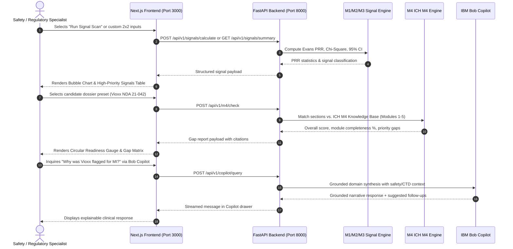

# System Architecture: Drug Safety & Regulatory Readiness Platform

---

## High-Level System Architecture

The following diagram illustrates the complete system architecture, highlighting component interactions, data processing pipelines, analytical compute engines, and the integration of the IBM Bob Copilot:

```mermaid
flowchart TD
    U[Safety & Regulatory Users] --> F[PharmSignals Enterprise Frontend (Next.js 14)]

    subgraph Presentation_Layer [Presentation Layer (Module M5)]
        F --> V1[Mode 1: Signal Detection, Clustering Studio & Bubble Chart]
        F --> V2[Historical Longitudinal Backtesting View]
        F --> V3[Mode 2: ICH M4 Submission Readiness View]
        F --> COPILOT[Docked IBM Bob AI Copilot Drawer]
    end

    F --> API[FastAPI Application Backend (Port 8000)]

    subgraph Backend_Services [Backend Analytical & RAG Engines]
        API --> M1[Module M1: FAERS Ingestion, Cleaning & Normalization]
        M1 --> CLUSTER[Module M1: Adverse Event Clustering Engine (scikit-learn KMeans & PCA)]
        M1 --> M2[Module M2: Evans PRR & Chi-Square Engine]
        M2 --> M3[Module M3: Digital Twin Time-Series Trajectory]
        
        API --> M4[Module M4: ICH M4 CTD Readiness Engine]
        M4 --> KB[(Authoritative ICH M4 Knowledge Base Modules 1–5)]
        M4 --> RAG[Hybrid Search & Completeness Scorer]
        
        API --> BOB[IBM Bob Copilot Reasoning Engine]
    end

    subgraph AI_Reasoning [AI & Grounding Layer]
        RAG --> LLM[Google Gemini 2.5 Flash]
        BOB --> LLM
        RAG --> FALLBACK[Deterministic Regulatory Fallback Engine]
        BOB --> FALLBACK
    end

    CLUSTER --> F
    M2 --> F
    M3 --> F
    M4 --> F
    BOB --> F
```

---

## Component Responsibilities

### 1. Presentation Layer (Frontend — Module M5)
- **Framework**: React 18, Next.js 14 (App Router), TypeScript, Tailwind CSS, Recharts
- **Design System**: White-first clinical enterprise layout (PharmSignals) with high information density, compact cards, and accessible semantic colors.
- **Responsibilities**:
  - **Adverse Event Clustering Studio**: Interactive 2D PCA Clinical Landscape displaying multi-dimensional clusters with interactive hover inspection and cluster archetype cards (*Acute Ischemia*, *Severe Organ Toxicity*, *Metabolic Syndromes*, *General Reactions*).
  - **Adverse Event Bubble Chart**: Plots Proportional Reporting Ratio (PRR) vs. Case Count ($a$) with a critical reference line at $\text{PRR} = 2.0$.
  - **High-Priority Signals Table**: Ranked tabular view of confirmed FAERS safety signals with instant triage actions.
  - **2×2 Interactive Calculator**: Real-time contingency matrix calculation for candidate drug-event pairs with benchmark presets.
  - **Historical Backtesting Station**: Reconstructs monthly PRR trajectories across historical benchmarks (Vioxx, Avandia, Baycol).
  - **Submission Readiness View**: Circular readiness gauge, horizontal CTD Module 1–5 progress meters, and filterable priority regulatory gap matrix.
  - **IBM Bob Copilot Drawer**: Docked conversational assistant for natural-language safety and regulatory inquiries.

### 2. Application API Layer (Backend — FastAPI)
- **Framework**: Python 3.10+, FastAPI, Uvicorn, Pydantic v2, HTTPX
- **Responsibilities**:
  - Exposes RESTful endpoints for signal summary, multidimensional clustering (`/api/v1/signals/clusters`), custom 2×2 calculations, backtest trajectories, CTD dossier evaluations (text, JSON, PDF), and conversational copilot inquiries.
  - Enforces schema validation and structured error handling.
  - Manages stateless compute with sub-second response times.

### 3. Data Processing & Analytical Engines (Modules M1, M2, M3)
- **FAERS Ingest & Normalization Engine (M1)**:
  - Ingests real openFDA FAERS adverse event datasets, performs uppercase MedDRA term normalization, and constructs 2×2 contingency tables ($a, b, c, d$).
- **Adverse Event Clustering Engine (M1 / ML)**:
  - Uses `scikit-learn` (`StandardScaler`, `KMeans`, `PCA`) to cluster adverse event feature vectors across 7 dimensions: $\log(\text{PRR})$, $\log(\text{Cases})$, Mortality Rate, Hospitalization Rate, Serious Event Rate, Mean Patient Onset Age, and Female Sex Ratio.
  - Produces clinically interpretable cluster archetypes and 2D coordinates for interactive frontend exploration.
- **Evans PRR Signal Detection Engine (M2)**:
  - Computes Proportional Reporting Ratios (PRR), Pearson Chi-Square ($\chi^2$), $p$-values, and log-normal 95% Confidence Intervals:
    $$\text{PRR} = \frac{a / (a + b)}{c / (c + d)}$$
  - Enforces standard regulatory criteria ($\text{PRR} \ge 2.0$, $\chi^2 \ge 4.0$, $a \ge 3$) to classify associations as `SIGNAL`, `WEAK_SIGNAL`, or `NOISE`.
- **Digital Twin Historical Backtest Engine (M3)**:
  - Executes longitudinal monthly walk-forward backtesting over openFDA FAERS records.
  - Demonstrates **+242 days** of early detection lead time for Vioxx (Jan 31, 2004 vs. Sept 30, 2004 withdrawal) and **+1,205 days** for Avandia, while transparently identifying electronic record boundaries for Baycol (`DATA_UNAVAILABLE_PRE_WITHDRAWAL`).

### 4. Regulatory Readiness & RAG Engine (Module M4)
- **ICH M4 CTD Knowledge Base**:
  - Authoritative repository of structural requirements across Module 1 (Administrative), Module 2 (Summaries), Module 3 (Quality/CMC), Module 4 (Nonclinical), and Module 5 (Clinical).
- **Hybrid Retrieval & Completeness Scorer**:
  - Evaluates candidate dossier sections, matches against verified ICH guidelines, calculates module-wise and overall completeness percentages, and compiles prioritized gap reports with actionable remediation advice.

### 5. AI Reasoning & IBM Bob Copilot Layer
- **Conversational Orchestrator**: Provides context-aware, domain-specific Q&A across active safety analytics, PRR methodology, and CTD readiness data.
- **Deterministic Offline Fallback**: Guarantees zero hallucinations and reliable responses even without external API keys.

---

## End-to-End Data Flow



---

## Component Table

| Layer | Component | Technology | Responsibility |
|---|---|---|---|
| **Frontend** | Client Interface | Next.js 14, React 18, Tailwind CSS, Recharts | Interactive dashboards, Bubble Charts, 2D PCA cluster landscapes, CTD meters, Bob drawer |
| **API** | REST Gateway | FastAPI, Uvicorn, Pydantic v2 | 17 REST endpoints, asynchronous request handling, schema validation, CORS |
| **Analytics (M1)** | Ingestion & Clustering | Pandas, scikit-learn (`KMeans`, `PCA`, `StandardScaler`) | openFDA FAERS cleaning, 7-dimension clustering into 4 clinical phenotypes |
| **Analytics (M2)** | PRR & Chi-Square | NumPy, SciPy (`scipy.stats.chi2_contingency`) | Evans disproportionality, uncorrected Pearson chi-square, 95% log-normal CIs |
| **Analytics (M3)** | Digital Twin Backtest | Pandas, NumPy | Longitudinal monthly walk-forward simulation, early detection lead-time calculation |
| **Readiness (M4)** | ICH M4 RAG Engine | In-Memory Retrieval, Pydantic v2 | Authoritative Modules 1–5 guideline verification, completeness scoring, gap severity |
| **Copilot** | Domain Reasoning | IBM Bob, Google Gemini 2.5 Flash, Rule Fallback | Live domain context injection, explainable clinical narrative, zero-hallucination fallback |

---

## Security, Scalability & Limitations

### Security & Privacy
1. **Local & In-Memory Compute**: All FAERS record processing, contingency tables, and candidate dossier parsing happen in-memory without persistent external database leaks.
2. **Stateless Processing**: Uploaded PDF dossiers and raw outline texts are parsed ephemerally; no proprietary sponsor documents are retained.
3. **Zero Secrets in Source**: No credentials are committed to version control; dummy placeholders are provided in `src/.env.example`.

### Scalability Considerations
1. **Vectorized Analytics**: PRR and $\chi^2$ calculations leverage vectorized NumPy operations, handling tens of thousands of drug-event pairs in sub-second response windows.
2. **Modular Architecture**: Backend analytical engines (M1–M4) operate independently and can be decoupled into microservices or distributed Celery worker tasks for enterprise-scale FAERS batch loads.
3. **Client-Side Rendering**: High-density interactive charts (Bubble Chart, 2D PCA Landscape) are rendered client-side using Recharts and Web APIs for smooth interactivity.

### Limitations
1. **Decision Support Only**: The platform is an analytical assistant for safety and regulatory teams and does not replace statutory health authority filings or qualified clinical judgment.
2. **Historical openFDA Electronic Records**: FAERS electronic data begins in 2004; earlier historical events (e.g. Baycol 2001) are handled with explicit electronic boundary notices.
