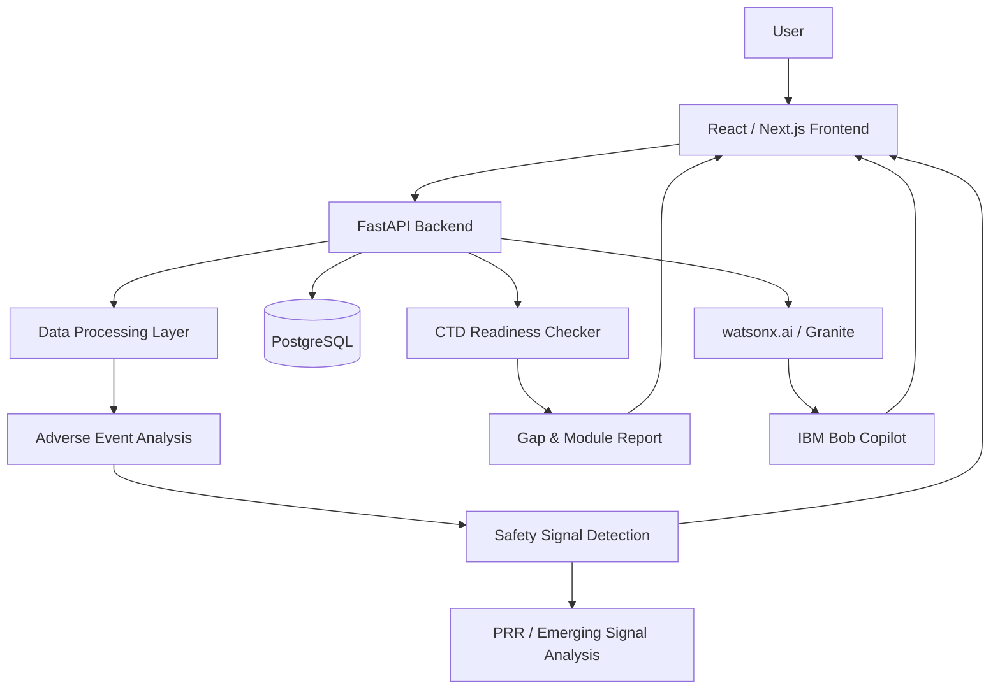

# System Architecture: Drug Safety & Regulatory Readiness Platform

---

## High-Level System Architecture

The following diagram illustrates the target system architecture, highlighting component interactions, data processing pipelines, AI reasoning layers, and the integration of IBM Bob Copilot:

---

## Component Responsibilities

### 1. Presentation Layer (Frontend)
- **Framework**: React / Next.js
- **Responsibilities**:
  - Delivers an intuitive, responsive interface with dedicated views for the **Safety Dashboard**, **CTD Readiness Checker**, and docked **IBM Bob Copilot**.
  - Renders statistical visualizations (adverse event distributions, PRR disproportionality heatmaps, timeline trends) using charting libraries (Recharts / Chart.js).
  - Provides interactive CTD dossier inspection trees and downloadable gap assessment reports.
  - Manages real-time conversational streaming with the IBM Bob Copilot service.

### 2. Application API Layer (Backend)
- **Framework**: Python / FastAPI
- **Responsibilities**:
  - Exposes RESTful endpoints for data ingestion, analytical execution, dossier inspection, and copilot dialogue.
  - Implements input validation, schema enforcement, and structured error handling.
  - Orchestrates analytical pipelines, database queries, and AI model invocations.

### 3. Data Processing & Analytical Engines
- **Adverse Event & PRR Analysis Engine**:
  - Ingests raw adverse-event records, performs grouping/clustering, and computes 2x2 contingency tables for drug-event pairs.
  - Calculates Proportional Reporting Ratios (PRR), Chi-Square statistics, and 95% confidence intervals.
  - Evaluates time-series trends to flag sudden shifts in reporting rates.
- **CTD Readiness & Gap Checker**:
  - Traverses submission folder structures against standard ICH M4 schemas (Modules 1–5).
  - Evaluates section presence, completeness, file naming conventions, and metadata validity.
  - Computes granular module scores and synthesizes prioritized gap reports.

### 4. Persistence Layer
- **Database**: PostgreSQL
- **Responsibilities**:
  - Stores normalized adverse-event datasets, drug registries, and historical signal metrics.
  - Persists ICH M4 validation rule sets, submission audit records, and user session contexts.

### 5. AI Reasoning & IBM Bob Copilot Layer
- **IBM watsonx.ai / Granite**: Foundation models providing natural-language generation of explainable safety alerts and gap remediation summaries.
- **IBM Bob Integration**: Conversational orchestrator providing context-aware, domain-specific Q&A across active safety analytics and CTD readiness data.

---

## End-to-End Data Flow

1. **User Action**: The user uploads an adverse event dataset or points the system to a CTD submission dossier.
2. **API Ingestion**: FastAPI receives the payload, validates the format, and dispatches it to the processing pipeline.
3. **Analytical Execution**:
   - For safety data: Pandas calculates frequencies, clusters events, and computes PRR metrics.
   - For CTD dossiers: The readiness checker audits directory trees against ICH M4 specifications and calculates completeness percentages.
4. **AI Context Synthesis**: Analytical summaries are passed to IBM watsonx.ai to generate human-readable explanations and remediation steps.
5. **Dashboard Rendering**: The React frontend receives structured metrics, displaying visual charts, readiness indicators, and gap matrices.
6. **Copilot Interaction**: The user asks follow-up questions (e.g., *"Why was this signal flagged?"* or *"What is missing in Module 4?"*); IBM Bob accesses context to deliver instant, explainable answers.

---

## Role of AI and IBM Bob

| AI Capability | Technology | Operational Function |
|---|---|---|
| **Signal Explainability** | IBM watsonx.ai / Granite | Translates numeric PRR scores, case counts, and clustering outputs into clinical rationale narratives. |
| **Gap Remediation Planning** | IBM watsonx.ai / Granite | Converts missing-section lists into actionable, step-by-step submission remediation guidance. |
| **Conversational Copilot** | IBM Bob Integration | Serves as a load-bearing assistant enabling natural-language queries across active dashboard data and dossier reports. |

---

## Security & Compliance Considerations

- **Data Privacy & Redaction**: Adverse event records and clinical study documents must be scrubbed of Protected Health Information (PHI) / Personally Identifiable Information (PII) before ingestion.
- **Zero Real Secrets in Code**: All API keys, database connection strings, and endpoints are configured strictly via environment variables (`.env`).
- **Role-Based Access**: Access controls ensure only authorized personnel can view sensitive clinical submission data or modify compliance rule sets.
- **Audit Logging**: Immutable logging of all dossier validation checks and safety signal triage decisions.

---

## Scalability Considerations

- **Asynchronous Processing**: FastAPI's asynchronous architecture handles concurrent analytical workloads efficiently.
- **Chunked Data Operations**: Large adverse event datasets are processed using vectorized Pandas routines and chunked database queries.
- **Stateless Services**: The API and copilot services are designed to be stateless, facilitating horizontal scaling and containerization.

---

## Implementation Status

| Component | Status | Notes |
|---|---|---|
| Repository & Documentation Skeleton | Complete | Ready for hackathon submission verification |
| Source Folder Hierarchy (`src/frontend`, `src/backend`) | Scaffolded | Directory layout and dependency manifests prepared |
| Analytical Engines (PRR & CTD Checker) | In Planning / MVP Phase | Algorithms and schemas designed; core implementation upcoming |
| IBM Bob & watsonx.ai Integration | In Planning / MVP Phase | Prompts, context schemas, and copilot endpoints designed |
| User Interface Components | In Planning / MVP Phase | Component hierarchy designed for React / Next.js |
